# 🍣 Minza's Sushi House - E-Commerce Platform

> A modern, responsive e-commerce web application for ordering premium sushi and Japanese cuisine online.

## 📖 Project Overview

Minza's Sushi House is a fully functional e-commerce platform built with vanilla JavaScript, featuring a sophisticated shopping cart, dynamic pricing rules, and a comprehensive checkout system. The project demonstrates advanced web development techniques including responsive design, accessibility features, and complex business logic implementation.

**Live Demo:** https://medieinstitutet.github.io/fed25d-js-intro-inl-1-minza-42/

## ✨ Key Features

### 🛒 Shopping Experience

- **Dynamic Product Catalog** with filtering and sorting
- **Smart Shopping Cart** with real-time price calculations
- **Quantity Controls** with validation (max 20 per product)
- **Persistent Cart** using localStorage
- **15-minute Inactivity Timeout** for cart security

### 💰 Pricing & Discounts

- **Monday Morning Discount** (10% off before 10:00 AM)
- **Weekend Surcharge** (15% from Friday 15:00 to Monday 03:00)
- **Bulk Discount** (10% off when ordering 10+ of the same product)
- **Discount Codes** (SUSHI10 for 10%, SUSHI20 for 20%)
- **Smart Shipping** (Free shipping on 15+ items, otherwise 25 SEK + 10% of cart)

### 📦 Checkout System

- **Comprehensive Form Validation** with real-time error messages
- **Multiple Payment Methods** (Card & Invoice)
- **Invoice Limit** (disabled for orders over 800 SEK)
- **15-minute Checkout Timer** with automatic form reset
- **GDPR Compliance** checkbox

### 🎨 Design & UX

- **Dark/Light Mode Toggle** with persistent preference
- **Fully Responsive** design (320px - 1920px+)
- **Touch-Optimized** for mobile and tablet devices
- **Smooth Animations** including "flying cart" effect
- **Accessibility First** with ARIA labels and keyboard navigation

## 🖼️ Screenshots

### Desktop View - Dark Mode

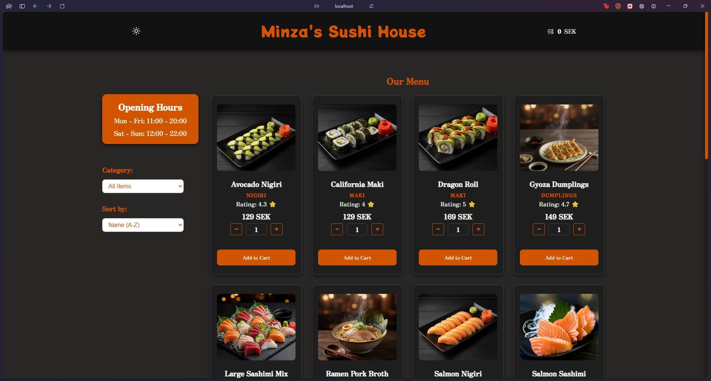

### Desktop View - Light Mode

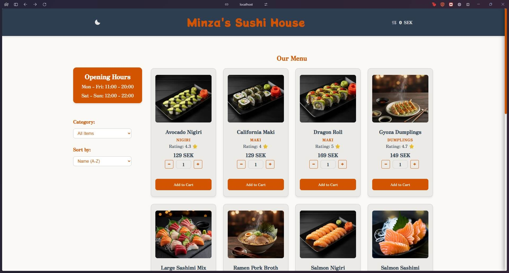

### Mobile View - Cart Drawer

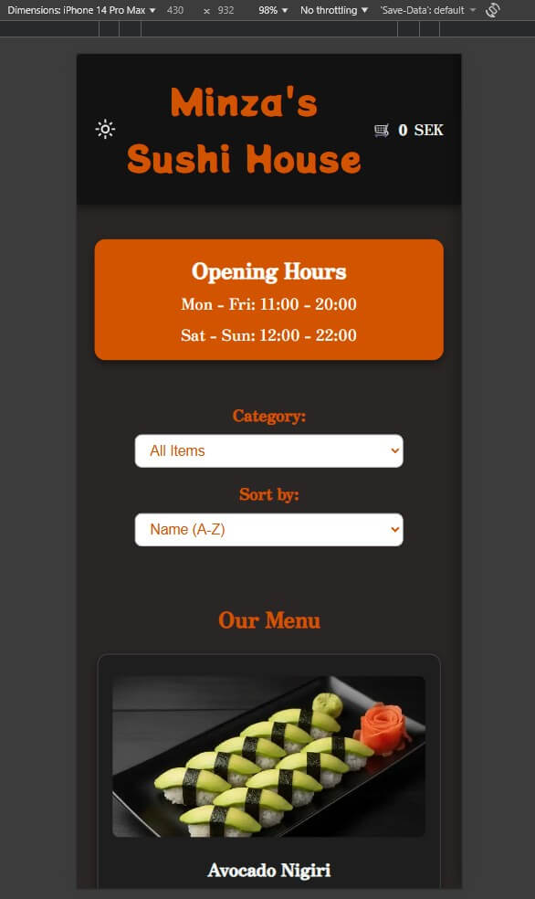

### Tablet View - iPad

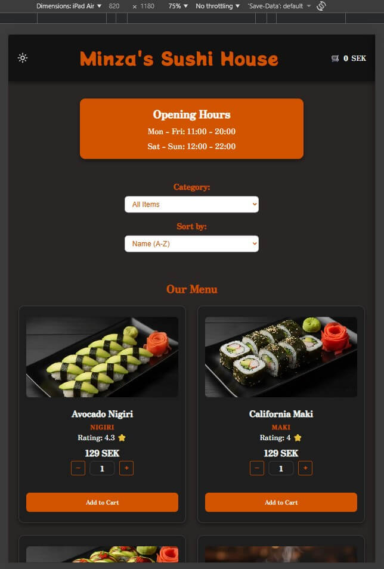

### Checkout Form

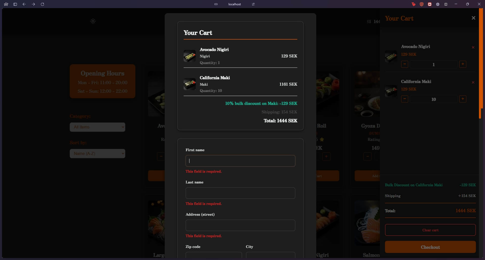

### HTML

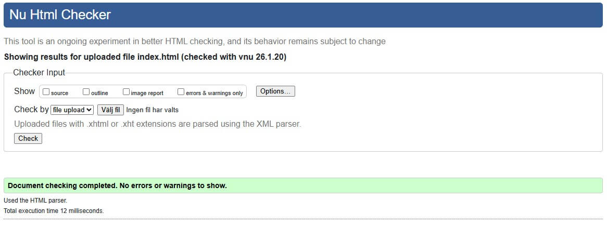

### CSS Validation

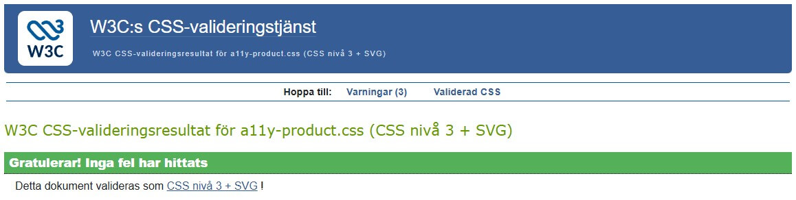
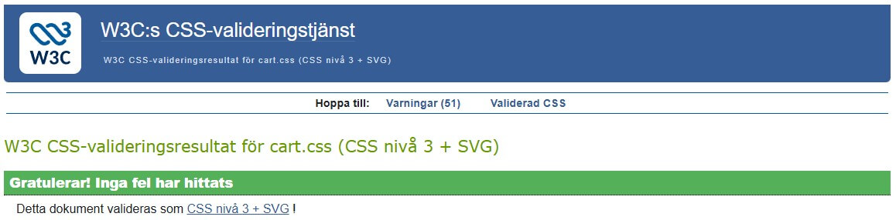
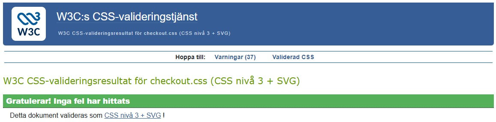

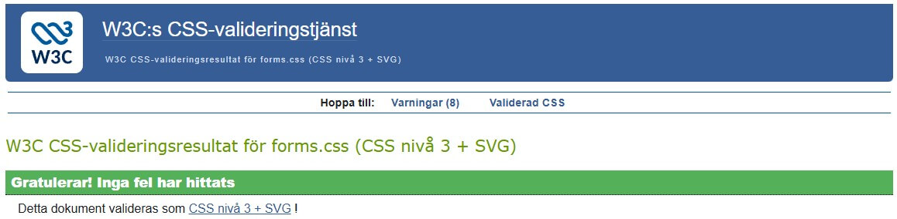
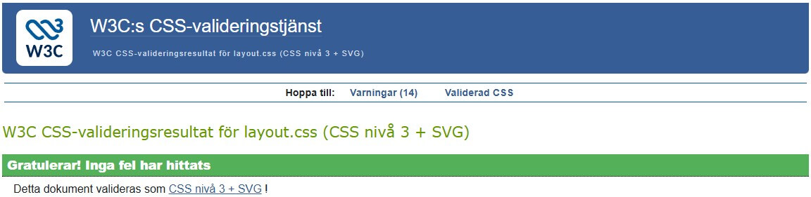
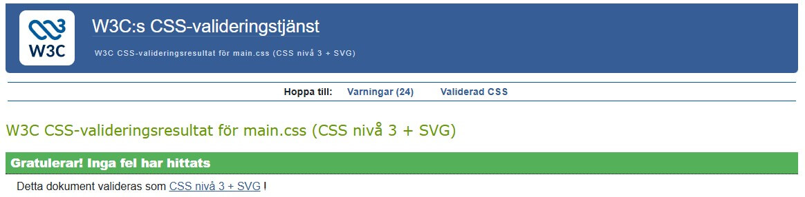
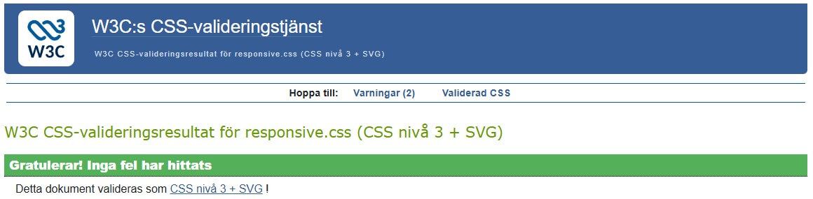
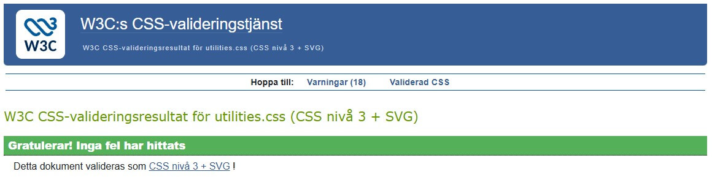

## 🛠️ Technologies Used

### Frontend

- **HTML5** - Semantic markup with accessibility features
- **CSS3** - Custom properties, Grid, Flexbox, animations
- **Vanilla JavaScript (ES6+)** - Modules, async/await, event delegation

### Architecture

- **Modular JavaScript** - Separate files for concerns (main, checkout, discounts, theme)
- **CSS Architecture** - Component-based styling with 7 separate CSS files
- **LocalStorage API** - For cart persistence and user preferences

### Development

- **Git** - Version control
- **VS Code** - Development environment
- **W3C Validators** - HTML & CSS validation

## 📂 Project Structure

```text
minza-sushi-house/
├── index.html                # Main entry point & app structure
├── README.md                 # Project documentation & VG-reports
│
├── css/                      # Modular CSS Architecture
│   ├── main.css              # Entry point for styles & @imports
│   ├── variables.css         # CSS Custom Properties (colors, spacing)
│   ├── layout.css            # Grid, header/footer & page structure
│   ├── components.css        # Reusable UI (product cards, buttons)
│   ├── forms.css             # Form inputs & validation styling
│   ├── cart.css              # Shopping cart drawer & overlay
│   ├── checkout.css          # Specific styles for the checkout modal
│   ├── utilities.css         # Animations & accessibility helpers
│   ├── responsive.css        # Media queries (Mobile-first approach)
│   └── a11y-product.css      # Screen reader & focus enhancements
│
├── src/                      # JavaScript Logic (ES-Modules)
│   ├── main.js               # Product rendering & cart management
│   ├── checkout.js           # Form validation & checkout timeout
│   ├── discounts.js          # Pricing engine & business rules
│   └── theme.js              # Dark/light mode state & logic
│
└── img/                      # Assets
    └── screenshots/          # Validation & Lighthouse reports
```

## 🚀 Getting Started

### Prerequisites

- Modern web browser (Chrome, Firefox, Safari, Edge)
- Local web server (optional, for development)

### Installation

1. **Clone the repository**

   ```bash
   git clone https://github.com/yourusername/minza-sushi-house.git
   cd minza-sushi-house
   ```

2. **Open in browser**

   ```bash
   # Simply open index.html in your browser
   # OR use a local server:
   python -m http.server 8000
   # Then visit: http://localhost:8000
   ```

3. **Start shopping!**
   - Browse products
   - Add items to cart
   - Apply discount codes **(SUSHI10 or SUSHI20)**
   - Complete checkout

## 🧪 Testing Discount Rules

### Monday Morning Discount (10%)

- Visit the site on Monday between 00:00 - 09:59
- Add items to cart
- See "Monday Discount (10%)" applied automatically

### Weekend Surcharge (15%)

- Visit Friday after 15:00, or Saturday/Sunday, or Monday before 03:00
- Prices automatically increase by 15% (hidden from customer)

### Bulk Discount (10%)

- Add 10+ of the same product
- See "Bulk Discount on [Product Name]" applied

### Discount Codes

- At checkout, enter code: `SUSHI10` (10% off) or `SUSHI20` (20% off)
- Click "Apply" to see discount

### Free Shipping

- Add 15+ items to cart (total quantity, not unique products)
- Shipping cost becomes 0 SEK

### Invoice Limit

- Add items totaling over 800 SEK
- Try selecting "Invoice" payment method
- See that it's disabled with explanation message

## ♿ Accessibility Features

- **ARIA Labels** on all interactive elements
- **Keyboard Navigation** fully supported (Tab, Enter, Space)
- **Screen Reader Friendly** with semantic HTML
- **Focus Indicators** visible on all focusable elements
- **Reduced Motion** support for users with vestibular disorders
- **Color Contrast** meets WCAG AA standards
- **Touch Targets** minimum 24x24px for mobile

## 📱 Responsive Breakpoints

- **Mobile Small:** 320px - 360px
- **Mobile:** 361px - 480px
- **Mobile Large:** 481px - 600px
- **Tablet:** 601px - 800px
- **Desktop Small:** 801px - 1100px
- **Desktop:** 1100px+
- **Landscape Mode:** Special optimization for height < 600px

## 🎯 Business Rules Implementation

### Minza's Sushi House Special Rules ✅

All business rules are fully implemented and tested:

1. ✅ Monday discount (10% before 10:00)
2. ✅ Weekend surcharge (15% Friday 15:00 - Monday 03:00)
3. ✅ Invoice blocked above 800 SEK
4. ✅ Bulk discount (10% for 10+ of same product)
5. ✅ Smart shipping (Free on 15+ items)
6. ✅ 15-minute timeout for checkout

## 📝 Code Quality

- ✅ **HTML Validated** - W3C HTML Validator
- ✅ **CSS Validated** - W3C CSS Validator
- ✅ **No Swenglish** - Consistent English naming
- ✅ **Semantic HTML** - Proper use of HTML5 elements

## 🔮 Future Enhancements

- [ ] Backend integration with Node.js/Express
- [ ] Database for products and orders
- [ ] User authentication & order history
- [ ] Payment gateway integration (Stripe/Klarna)
- [ ] Email confirmations
- [ ] Admin panel for product management
- [ ] Multi-language support (Swedish/English)
- [ ] Progressive Web App (PWA) features

## 🙏 Acknowledgments

- **Fonts:** Google Fonts (Potta One, Zen Antique)
- **Icons:** Custom SVG icons
- **Images:** [Source of product images]
- **Inspiration:** Modern e-commerce best practices

---

**Made with ❤️ and 🍣 by Minai Karlsson**
